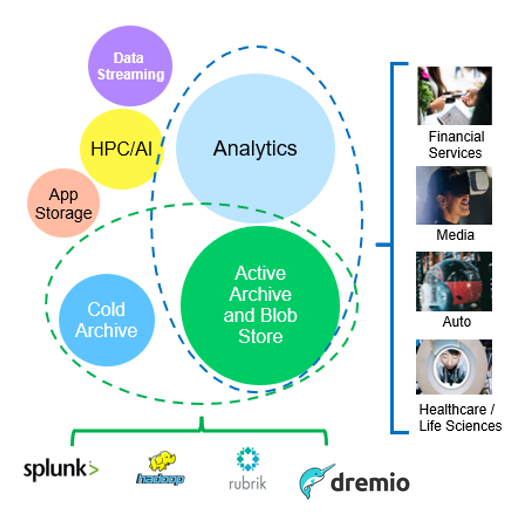
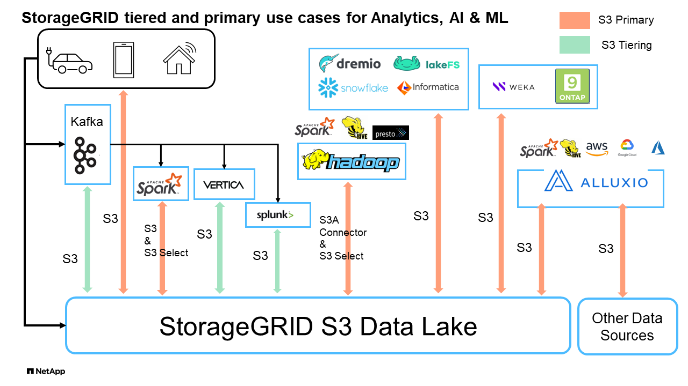

= NetApp StorageGRID和大数据分析
:allow-uri-read: 

== NetApp StorageGRID用例

NetApp StorageGRID对象存储解决方案可提供可扩展性、数据可用性、安全性和高性能。各种规模和各行各业的组织都在广泛的使用情形中使用StorageGRID S3。让我们来了解一些典型场景：

*大数据分析：* StorageGRID S3常用作数据湖、企业可在其中存储大量结构化和非结构化数据、以便使用Apache Spark、Splunk Smartstore和DREMIO等工具进行分析。

*数据分层：* NetApp客户使用ONTAP的FabricPool功能在高性能本地层之间自动将数据移动到StorageGRID。在将冷数据保留在低成本对象存储上的同时、将昂贵的闪存存储释放出来、以存储热数据。这样可以最大限度地提高性能并节省成本。

*数据备份和灾难恢复：*企业可以使用StorageGRID S3作为可靠且经济高效的解决方案来备份关键数据并在发生灾难时进行恢复。

*应用程序的数据存储：* StorageGRID S3可用作应用程序的存储后端，使开发人员能够轻松地存储和检索文件、图像、视频和其他类型的数据。

*内容交付：* StorageGRID S3可用于存储静态网站内容、媒体文件和软件下载并提供给全球用户、利用StorageGRID的地区分布和全局命名空间实现快速可靠的内容交付。

*数据分层：* NetApp客户使用ONTAP FabricPool功能在高性能本地层之间自动将数据移动到StorageGRID。在将冷数据从低成本对象存储中随时可用的同时、通过层化释放昂贵的闪存存储来存储热数据。这样可以最大限度地提高性能并节省成本。

*数据归档：* StorageGRID提供不同的存储类型、并支持分层到公共长期低成本存储选项、使其成为出于合规性或历史目的需要保留的数据归档和长期保留的理想解决方案。

*对象存储用例*

在上述情形中、大数据分析是最热门的使用情形之一、其使用量呈上升趋势。

== 为什么选择StorageGRID解决数据湖问题？

* 增强协作—利用行业标准API访问实现大规模共享多站点、多租户
* 降低运营成本—通过一个自我修复型自动化横向扩展架构简化运营
* 可扩展性—与传统的Hadoop和数据仓库解决方案不同、StorageGRID S3对象存储可将存储与计算和数据分离、从而使企业能够随着增长扩展存储需求。
* 耐用性和可靠性—StorageGRID的耐用性高达99.9999999%、这意味着存储的数据能够高度抵御数据丢失。它还提供高可用性、确保数据始终可访问。
* 安全性—StorageGRID提供各种安全功能、包括加密、访问控制策略、数据生命周期管理、对象锁定和版本控制、以保护S3存储分段中存储的数据

* StorageGRID S3数据湖*

== 哪种数据仓库或数据湖最适合S3对象存储

NetApp通过三个数据仓库/湖屋生态系统(Hive、Delta湖和德雷米奥)对StorageGRID进行了基准测试。 https://www.dremio.com/wp-content/uploads/2023/02/apache-iceberg-TDG_ER1.pdf?aliId=eyJpIjoieDRUYjFKN2ZMbXhTRnFRWCIsInQiOiJIUUw0djJsWnlJa21iNUsyQURRalNnPT0ifQ%253D%253D["Apache iceberg：权威指南"] 简要介绍了数据仓库和数据湖屋以及这两种架构的利弊。

* 基准测试工具- TPC-DS - https://www.tpc.org/tpcds/[]
* 大数据生态系统
+
** 一个由5个VM组成的集群、每个VM具有128 G RAM和24个vCPU、SSD存储用于系统磁盘
** 采用Hive 3.1.3的Hadoop 3.3.5 (1个名称节点+ 4个数据节点)
** 采用Spark 3.2.0 (1个主服务器+ 4个员工)和Hadoop 3.3.5的Delta Lake
** d不良V23 (1个主服务器+ 4个执行器)

* 对象存储
+
** NetApp^®^ StorageGRID^®^ 11.5，带有3个SG6060 + 1个SG1000负载平衡器
** 对象保护—2个副本

* 数据库大小为1000 GB
* 在所有3个生态系统上禁用缓存、以便在每个查询测试中获得一致的结果。

TPC-DS附带99个复杂的SQL查询、用于查询基准测试。我们测量了完成所有99个查询所需的总分钟数、并通过细分S3请求的类型和数量来深入分析结果。下面的第一个表显示了所有99个查询的总持续时间、第二个表汇总了每个生态系统发送到StorageGRID的S3请求的数量和类型。

*TPC-DS查询结果*

[cols="35%,20%,23%,22%"]
|===
| 生态系统 | 配置 | 三角洲湖 | Dremio 

| 存储层 | NetApp^®^ StorageGRID^®^ | NetApp^®^ StorageGRID^®^ | NetApp^®^ StorageGRID^®^ 

| 驱动器类型 | HDD | HDD | HDD 

| 表格格式 | 镶木地板 | 镶木地板 | 镶木地板^1^ 

| 数据库大小 | 1000 G | 1000 G | 1000 G 

| TPCDS 99查询+
总分钟数 | 1084 ^2^ | 55 | 47.1. 
|===
^1^测试了镶木地板和冰山一角表格式，结果相似。

^2^ Hive无法完成查询编号72。

*TPC-DS查询- S3请求细分*

[cols="24%,24%,27%,25%"]
|===
| S3请求 | 配置 | 三角洲湖 | Dremio 

| 获取 | 1、117184 | 2、074、610 | 4、414、227 

| 观察：+
所有范围GET | 从32 MB对象中获取2 KB到2 MB的80%范围、每秒50到100个请求 | 73%的范围从32 MB对象开始低于100 KB、每秒1000到1400个请求 | 从256MB对象获取90% 1M字节范围、2000到2300个请求/秒 

| 列出对象 | 312、053 | 24、158 | 240 

| 头部+
(不存在的对象) | 156、027 | 12、103 | 192. 

| 头部+
(存在的对象) | 982、126 | 922732 | 1、845 

| 请求总数 | 2. | 3、033、603 | 4、416、504 
|===
从第一张桌子上、我们可以看到Delta Lake和德雷米奥比Hive快得多。从第二个表中、我们注意到Hive发送了大量S3列表对象请求、这在所有对象存储平台中通常都很慢、尤其是在处理包含许多对象的分段时。这会显著增加整体查询持续时间。另一个观察结果是、在Hive中、德尔米奥能够并行发送大量GET请求、每秒2000到2、300个请求、而每秒50到100个请求。Hive和Hadoop S3A模拟标准文件系统会导致S3对象存储运行减速。

要将Hadoop (无论是在HDFS还是S3对象存储上)与Hive或Spark结合使用、需要具备有关Hadoop和Hive或Spark以及每个服务中的设置如何交互的广泛知识—它们共同具有1000多个设置。这些设置通常是相互关联的、不能单独更改。要找到要使用的设置和值的最佳组合、需要花费大量时间和精力。

dremio是一种数据湖引擎、它使用端到端Apache Arrow(阿帕奇箭头)来显著提高查询性能。Apache Arrow"提供标准化的列式内存格式、可实现高效的数据共享和快速分析。ARrow采用不受语言限制的方法、旨在消除数据序列化和反序列化的需求、从而提高复杂数据流程和系统之间的性能和互操作性。

在很大程度上、Mirio的性能取决于其集群的计算能力。虽然desmio会使用Hadoop的S3A连接器建立S3对象存储连接、但不需要使用Hadoop、并且desmio不会使用Hadoop的大多数FS.S3A设置。这样、无需花费时间学习和测试各种Hadoop S3A设置、即可轻松调整德米奥的性能。

根据此基准测试结果、我们可以得出结论、针对基于S3的工作负载进行优化的大数据分析系统是一个主要性能因素。在使用S3存储时、由于使用的是Hive、因此、使用此解决方案可以优化查询执行、高效利用元数据并提供对S3数据的无缝访问、从而获得比Hive更高的性能。请参见此部分 https://docs.netapp.com/us-en/storagegrid-enable/tools-apps-guides/configure-dremio-storagegrid.html["页面。"] 使用StorageGRID配置d不良S3数据源。

请访问以下链接、详细了解StorageGRID和德莱米奥如何协同工作来提供现代化且高效的数据湖基础架构、以及NetApp如何从Hive + HDFS迁移到德莱米奥+ StorageGRID来显著提高大数据分析效率。

* https://www.netapp.tv/details/31426?mcid=02148179640195118863901007338453703701["借助NetApp StorageGRID提升大数据的性能"]
* https://www.netapp.com/media/80932-SB-4236-StorageGRID-Dremio.pdf["借助StorageGRID和d处 米奥打造现代化、功能强大且高效的数据湖基础架构"]
* https://youtu.be/Y57Gyj4De2I?si=nwVG5ohCj93TggKS["NetApp如何利用产品分析重新定义客户体验"]

