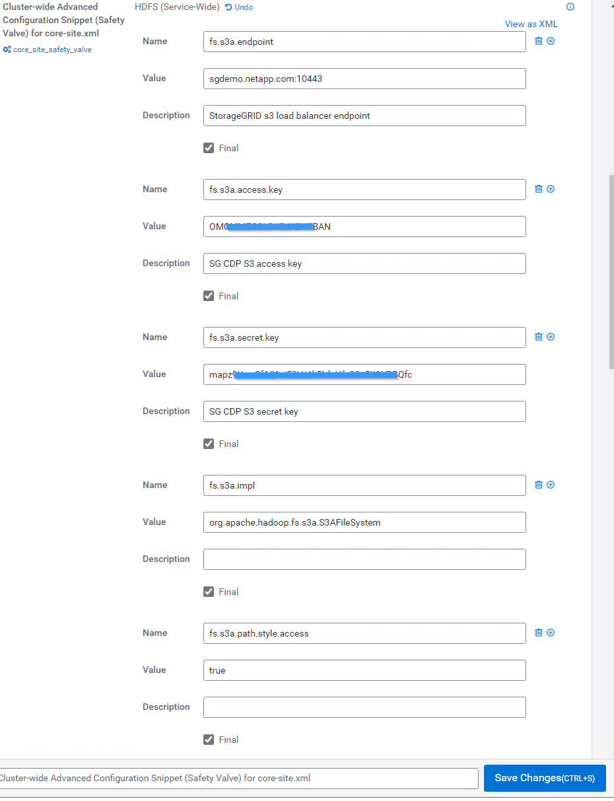

= 将Cloudera Hadoop S3A连接器与StorageGRID 结合使用
:allow-uri-read: 

[role="lead"]
Hadoop在一段时间内一直是数据科学家的青睐。通过Hadoop、可以使用简单的编程框架在多个计算机集群之间分布式处理大型数据集。Hadoop旨在从单个服务器扩展到数千台计算机、每台计算机都拥有本地计算和存储。

== 为什么要使用S3A执行Hadoop工作流？

随着数据量的不断增长、使用自己的计算和存储添加新计算机的方法变得效率低下。线性扩展解决了高效利用资源和管理基础架构的难题。

为了应对这些挑战、Hadoop S3A客户端可为S3对象存储提供高性能I/O。使用S3A实施Hadoop工作流有助于将对象存储用作数据存储库、并将计算和存储分开、进而使您能够独立扩展计算和存储。通过分离计算和存储、您还可以将适当数量的资源专用于计算作业、并根据数据集的大小提供容量。因此、您可以降低Hadoop工作流的总体TCO。

== 将S3A连接器配置为使用StorageGRID

=== 前提条件

* 用于Hadoop S3A连接测试的StorageGRID S3端点URL、租户S3访问密钥和机密密钥。
* Cloudera集群以及对集群中每个主机的root或sudo权限、用于安装Java软件包。

截至2022年4月、使用Cloudera 7.1.7的Java 11.0.14已针对StorageGRID 11.5和11.5进行了测试。但是、新安装时的Java版本号可能会有所不同。

=== 安装Java软件包

. 检查 https://docs.cloudera.com/cdp-private-cloud-upgrade/latest/release-guide/topics/cdpdc-java-requirements.html["Cloudera支持表"^] 支持的JDK版本。
. 下载 https://www.oracle.com/java/technologies/downloads/["Java 11.x软件包"^] 与Cloudera集群操作系统匹配。将此软件包复制到集群中的每个主机。在此示例中、rpm软件包用于CentOS。
. 以root身份或使用具有sudo权限的帐户登录到每个主机。在每个主机上执行以下步骤：
+
.. 安装软件包：
+
[listing]
----
$ sudo rpm -Uvh jdk-11.0.14_linux-x64_bin.rpm
----
.. 检查Java的安装位置。如果安装了多个版本、请将新安装的版本设置为默认值：
+
[listing, subs="specialcharacters,quotes"]
----
alternatives --config java

There are 2 programs which provide 'java'.

  Selection    Command
-----------------------------------------------
 +1           /usr/java/jre1.8.0_291-amd64/bin/java
  2           /usr/java/jdk-11.0.14/bin/java

Enter to keep the current selection[+], or type selection number: 2
----
.. 将此行添加到`/etc/profile`的末尾。路径应与上述选择的路径匹配：
+
[listing]
----
export JAVA_HOME=/usr/java/jdk-11.0.14
----
.. 运行以下命令以使配置文件生效：
+
[listing]
----
source /etc/profile
----

=== Cloudera HDFS S3A配置

* 步骤 *

. 从Cloudera Manager GUI中、选择Clusters > HDFS、然后选择Configuration。
. 在类别下、选择高级、然后向下滚动以找到`core-site.xml的集群范围高级配置片段(安全阀)`。
. 单击(+)符号并添加以下值对。
+
[cols="1a,4a"]
|===
| Name | 价值 

 a| 
fs.s3a.access.key
 a| 
_< StorageGRID 中的租户S3访问密钥>_

 a| 
fs.s3a.secret.key
 a| 
_< StorageGRID 中的租户S3密钥>_

 a| 
fs.s3a.connection.ssl.enabled
 a| 
true或false (如果缺少此条目、则默认为https)

 a| 
fs.s3a.endpoint
 a| 
StorageGRID S3端点：端口>_

 a| 
fs.s3a.impl
 a| 
org.apache.hadoop.fs.s3a.s3AFileSystem

 a| 
fs.s3a.path.style.access
 a| 
true或false (如果缺少此条目、则默认为虚拟主机模式)

|===
+
*屏幕截图示例*

+

. 单击保存更改按钮。从HDFS菜单栏中选择陈旧配置图标、在下一页上选择重新启动陈旧服务、然后选择立即重新启动。
+
image::../media/hadoop-s3a/hadoop-restart-stale-service-icon.png[重新启动Hadoop的陈旧服务图标]

== 测试与StorageGRID 的S3A连接

=== 执行基本连接测试

登录到Cloudera集群中的一个主机、然后输入`Hadoop FS -ls S3a：//<bucket-name>_/`。

以下示例将使用路径sysle和已有的HDFS-test分段以及一个测试对象。

[listing]
----
[root@ce-n1 ~]# hadoop fs -ls s3a://hdfs-test/
22/02/15 18:24:37 WARN impl.MetricsConfig: Cannot locate configuration: tried hadoop-metrics2-s3a-file-system.properties,hadoop-metrics2.properties
22/02/15 18:24:37 INFO impl.MetricsSystemImpl: Scheduled Metric snapshot period at 10 second(s).
22/02/15 18:24:37 INFO impl.MetricsSystemImpl: s3a-file-system metrics system started
22/02/15 18:24:37 INFO Configuration.deprecation: No unit for fs.s3a.connection.request.timeout(0) assuming SECONDS
Found 1 items
-rw-rw-rw-   1 root root       1679 2022-02-14 16:03 s3a://hdfs-test/test
22/02/15 18:24:38 INFO impl.MetricsSystemImpl: Stopping s3a-file-system metrics system...
22/02/15 18:24:38 INFO impl.MetricsSystemImpl: s3a-file-system metrics system stopped.
22/02/15 18:24:38 INFO impl.MetricsSystemImpl: s3a-file-system metrics system shutdown complete.
----

=== 故障排除

==== 场景 1

使用HTTPS连接到StorageGRID 、并在15分钟超时后收到`shapore_failure`错误。

*原因：*旧版JRE/JDK使用过时或不受支持的TLS密码套件连接到StorageGRID。

*错误消息示例*

[listing]
----
[root@ce-n1 ~]# hadoop fs -ls s3a://hdfs-test/
22/02/15 18:52:34 WARN impl.MetricsConfig: Cannot locate configuration: tried hadoop-metrics2-s3a-file-system.properties,hadoop-metrics2.properties
22/02/15 18:52:34 INFO impl.MetricsSystemImpl: Scheduled Metric snapshot period at 10 second(s).
22/02/15 18:52:34 INFO impl.MetricsSystemImpl: s3a-file-system metrics system started
22/02/15 18:52:35 INFO Configuration.deprecation: No unit for fs.s3a.connection.request.timeout(0) assuming SECONDS
22/02/15 19:04:51 INFO impl.MetricsSystemImpl: Stopping s3a-file-system metrics system...
22/02/15 19:04:51 INFO impl.MetricsSystemImpl: s3a-file-system metrics system stopped.
22/02/15 19:04:51 INFO impl.MetricsSystemImpl: s3a-file-system metrics system shutdown complete.
22/02/15 19:04:51 WARN fs.FileSystem: Failed to initialize fileystem s3a://hdfs-test/: org.apache.hadoop.fs.s3a.AWSClientIOException: doesBucketExistV2 on hdfs: com.amazonaws.SdkClientException: Unable to execute HTTP request: Received fatal alert: handshake_failure: Unable to execute HTTP request: Received fatal alert: handshake_failure
ls: doesBucketExistV2 on hdfs: com.amazonaws.SdkClientException: Unable to execute HTTP request: Received fatal alert: handshake_failure: Unable to execute HTTP request: Received fatal alert: handshake_failure
----
*解析：*确保已安装JDK 11.x或更高版本并将其设置为默认Java库。请参见  Java package 部分、了解更多信息。

==== 场景2：

无法连接到StorageGRID 、并显示错误消息`无法找到所请求目标的有效证书路径`。

*原因：* StorageGRID S3端点服务器证书不受Java程序信任。

错误消息示例：

[listing]
----
[root@hdp6 ~]# hadoop fs -ls s3a://hdfs-test/
22/03/11 20:58:12 WARN impl.MetricsConfig: Cannot locate configuration: tried hadoop-metrics2-s3a-file-system.properties,hadoop-metrics2.properties
22/03/11 20:58:13 INFO impl.MetricsSystemImpl: Scheduled Metric snapshot period at 10 second(s).
22/03/11 20:58:13 INFO impl.MetricsSystemImpl: s3a-file-system metrics system started
22/03/11 20:58:13 INFO Configuration.deprecation: No unit for fs.s3a.connection.request.timeout(0) assuming SECONDS
22/03/11 21:12:25 INFO impl.MetricsSystemImpl: Stopping s3a-file-system metrics system...
22/03/11 21:12:25 INFO impl.MetricsSystemImpl: s3a-file-system metrics system stopped.
22/03/11 21:12:25 INFO impl.MetricsSystemImpl: s3a-file-system metrics system shutdown complete.
22/03/11 21:12:25 WARN fs.FileSystem: Failed to initialize fileystem s3a://hdfs-test/: org.apache.hadoop.fs.s3a.AWSClientIOException: doesBucketExistV2 on hdfs: com.amazonaws.SdkClientException: Unable to execute HTTP request: PKIX path building failed: sun.security.provider.certpath.SunCertPathBuilderException: unable to find valid certification path to requested target: Unable to execute HTTP request: PKIX path building failed: sun.security.provider.certpath.SunCertPathBuilderException: unable to find valid certification path to requested target
----
*解决方法：* NetApp建议使用由已知的公有 证书签名颁发机构颁发的服务器证书、以确保身份验证安全。或者、也可以向Java信任存储库添加自定义CA或服务器证书。

要将StorageGRID 自定义CA或服务器证书添加到Java信任存储、请完成以下步骤。

. 备份现有的默认Java cacerts.
+
[listing]
----
cp -ap $JAVA_HOME/lib/security/cacerts $JAVA_HOME/lib/security/cacerts.orig
----
. 将StorageGRID S3端点证书导入到Java信任存储。
+
[listing, subs="specialcharacters,quotes"]
----
keytool -import -trustcacerts -keystore $JAVA_HOME/lib/security/cacerts -storepass changeit -noprompt -alias sg-lb -file _<StorageGRID CA or server cert in pem format>_
----

==== 故障排除提示

. 提高Hadoop日志级别以进行调试。
+
`export Hadoop_root_logger = hadoop.root.logger = debug、console`

. 执行命令、并将日志消息定向到error.log。
+
`Hadoop FS -ls S3a：//<bucket-name>_/&>error.log`

