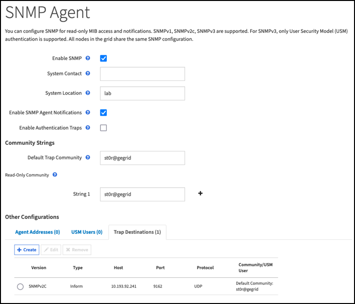

= Datadog SNMP配置
:allow-uri-read: 

[role="lead"]
配置Datadog以收集StorageGRID SNMP指标和陷阱。

== 配置Datadog

Datadog是一种监控解决方案 、可提供指标、可视化和警报功能。以下配置是在StorageGRID 系统本地部署的Ubuntu 22.04.1主机上使用Linux代理版本7.43.1实施的。

=== 从StorageGRID MIB文件生成的数据日志配置文件和陷阱文件

Datadog提供了一种将产品MIB文件转换为映射SNMP消息所需的数据日志参考文件的方法。

按照找到的说明生成用于数据日志陷阱解析映射的StorageGRID YAML文件 https://docs.datadoghq.com/network_monitoring/devices/snmp_traps/?tab=yaml["此处"^]。+将此文件放在/etc/datadog-agent/conf.d/snmp.d/traps_db/+中

* link:../media/datadog/NETAPP-STORAGEGRID-MIB.yml["下载陷阱YAML文件"] +
+
** * MD5校验和* 42e27e4210719945a46172b98c379517 +
** * SHA256校验和* d0fe5c8e6ca3c902d054f854b70a85f928cb8b7c76391d356f05d2cf73b6887 +

此StorageGRID 配置文件YAML文件用于数据日志指标映射、此文件是按照找到的说明生成的 https://datadoghq.dev/integrations-core/tutorials/snmp/introduction/["此处"^]。+将此文件放置在/etc/datadog-agent/conf.d/snmp.d/profiles/+中

* link:../media/datadog/netapp-storagegrid.yaml["下载配置文件YAML文件"] +
+
** * MD5校验和* 72bb7784f4801adda4e0c3ea77df19aa +
** * SHA256校验和* b6b7fadd330 63422a8bb8e39b3ead8ab38349ee0229926eadc8585f0087b8cee +

=== 用于衡量指标的SNMP Datadog配置

可以通过两种方式管理为指标配置SNMP。您可以通过提供包含StorageGRID 系统的网络地址范围来配置自动发现、也可以定义各个设备的IP。根据所做的决定、配置位置会有所不同。自动发现在数据日志代理YAML文件中定义。在SNMP配置YAML文件中配置显式设备定义。以下是同一StorageGRID 系统中的每个示例。

==== 自动发现

配置位于/etc/datadog-agent/datadog.yaml中

[source, yaml]
----
listeners:
  - name: snmp
snmp_listener:
  workers: 100  # number of workers used to discover devices concurrently
  discovery_interval: 3600  # interval between each autodiscovery in seconds
  loader: core  # use core check implementation of SNMP integration. recommended
  use_device_id_as_hostname: true  # recommended
  configs:
    - network_address: 10.0.0.0/24  # CIDR subnet
      snmp_version: 2
      port: 161
      community_string: 'st0r@gegrid'  # enclose with single quote
      profile: netapp-storagegrid
----

==== 单个设备

/etc/datadog-agent/conf.d/snmp.d/conf.yaml

[source, yaml]
----
init_config:
  loader: core  # use core check implementation of SNMP integration. recommended
  use_device_id_as_hostname: true  # recommended
instances:
- ip_address: '10.0.0.1'
  profile: netapp-storagegrid
  community_string: 'st0r@gegrid'  # enclose with single quote
- ip_address: '10.0.0.2'
  profile: netapp-storagegrid
  community_string: 'st0r@gegrid'
- ip_address: '10.0.0.3'
  profile: netapp-storagegrid
 community_string: 'st0r@gegrid'
- ip_address: '10.0.0.4'
  profile: netapp-storagegrid
  community_string: 'st0r@gegrid'
----

=== 陷阱的SNMP配置

SNMP陷阱的配置在datadog配置yaml文件/etc/datadog-agent/datadog.yaml中定义

[source, yaml]
----
network_devices:
  namespace:  # optional, defaults to “default”.
  snmp_traps:
    enabled: true
    port: 9162 # on which ports to listen for traps
    community_strings: # which community strings to allow for v2 traps
      - st0r@gegrid
----

=== StorageGRID SNMP配置示例

StorageGRID 系统中的SNMP代理位于配置选项卡的监控列下。启用SNMP并输入所需信息。如果要配置陷阱、请选择"陷阱目标"并为包含陷阱配置的Datadog代理主机创建一个目标。

